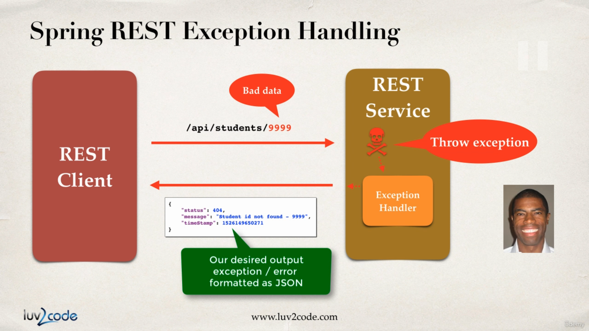

# Spring REST

- [Spring REST](#spring-rest)
  - [Overview](#overview)
    - [REST Web Service](#rest-web-service)
    - [JSON](#json)
  - [JSON Data Binding](#json-data-binding)
    - [Jackson Project](#jackson-project)
  - [Create Spring REST](#create-spring-rest)
  - [Retrieve POJOs as JSON](#retrieve-pojos-as-json)
  - [Use `@PathVariable` for Endpoints](#use-pathvariable-for-endpoints)
  - [Exception Handling](#exception-handling)
  - [API Design Best Practices](#api-design-best-practices)

## Overview

### REST Web Service

- REST calls can be made over HTTP.
- REST is language independent, so the client and server application can use any programming language.
- REST application can use any data format, but commonly use XML and JSON.
  - XML (Extensible Markup Language)
  - JSON (JavaScript Object Notation)
- We can find REST APIs on [ProgrammableWeb](https://www.programmableweb.com/)

### JSON

**JSON (JavaScript Object Notation)** is a lightweight data format for storing and exchanging data in plain text. It's language independent and not just for JavaScript. Let's see an example:

```json
{
  "id": 14,
  "firstName": "Mario",
  "lastName": "Rossi",
  "active": true,
  "languages": ["Java", "C#", "Python", "JavaScript"],
  "address": {
    "street": "100 Main St",
    "city": "Philadelphia",
    "state": "Pennsylvania",
    "zip": "19103",
    "country": "USA"
  },
  "courses": null
}
```

- Use curley braces define objects in JSON.
- Object members are name/value pairs delimited by colons.
- Name should always in double-quotes.
- Arrays member use square brackets.

<br/>
<div align="right">
  <b><a href="#spring-rest">[ ↥ Back To Top ]</a></b>
</div>
<br/>

## JSON Data Binding

### Jackson Project

**Data binding** is the process of converting JSON data to a Java POJO. Spring uses the [Jackson Project](https://github.com/FasterXML/jackson) behind the JSON behind the scenes. The Jackson data binding API located with package `com.fasterxml.jackson.databind` and can be added with Maven Dependency:

```xml
<dependency>
  <groupId>com.fasterxml.jackson.core</groupId>
  <artifactId>jackson-databind</artifactId>
  <version>2.12.4</version>
</dependency>
```

By default, Jackson will call appropriate getter/setter method for data binding instead of accessing internal private fields directly:

```java
// create object mapper
ObjectMapper mapper = new ObjectMapper();

// read JSON from file and map/convert to Java POJO
Student myStudent = mapper.readValue(new File("data/sample.json"), Student.class);
...

// write JSON to output file
mapper.enable(SerializationFeature.INDENT_OUTPUT);
mapper.writeValue(new File("data/output.json"), myStudent);
```

- Spring will automatically handle Jackson Integration when building Spring REST applications.
- JSON data being passed to REST controller is converted to Java POJO.
- Java object being returned from REST controller is converted to JSON.

<br/>
<div align="right">
  <b><a href="#spring-rest">[ ↥ Back To Top ]</a></b>
</div>
<br/>

## Create Spring REST

<br/>
<div align="right">
  <b><a href="#spring-rest">[ ↥ Back To Top ]</a></b>
</div>
<br/>

## Retrieve POJOs as JSON

<br/>
<div align="right">
  <b><a href="#spring-rest">[ ↥ Back To Top ]</a></b>
</div>
<br/>

## Use `@PathVariable` for Endpoints

<br/>
<div align="right">
  <b><a href="#spring-rest">[ ↥ Back To Top ]</a></b>
</div>
<br/>

## Exception Handling

Problem: 
1. Bad response format. Everything was dumped as HTML
2. Entire stack trace was visible, which we don't want end user to show.


What we want


Jackson will be responsible for actually converting the response body to JSON




What would happen if any other exception arises insted of StudentNotFoundException?


We have to modify our code to handle generic exceptions.


Handles all exceptions because 'Exception' is the root of all exceptions.


<br/>
<div align="right">
  <b><a href="#spring-rest">[ ↥ Back To Top ]</a></b>
</div>
<br/>

## API Design Best Practices